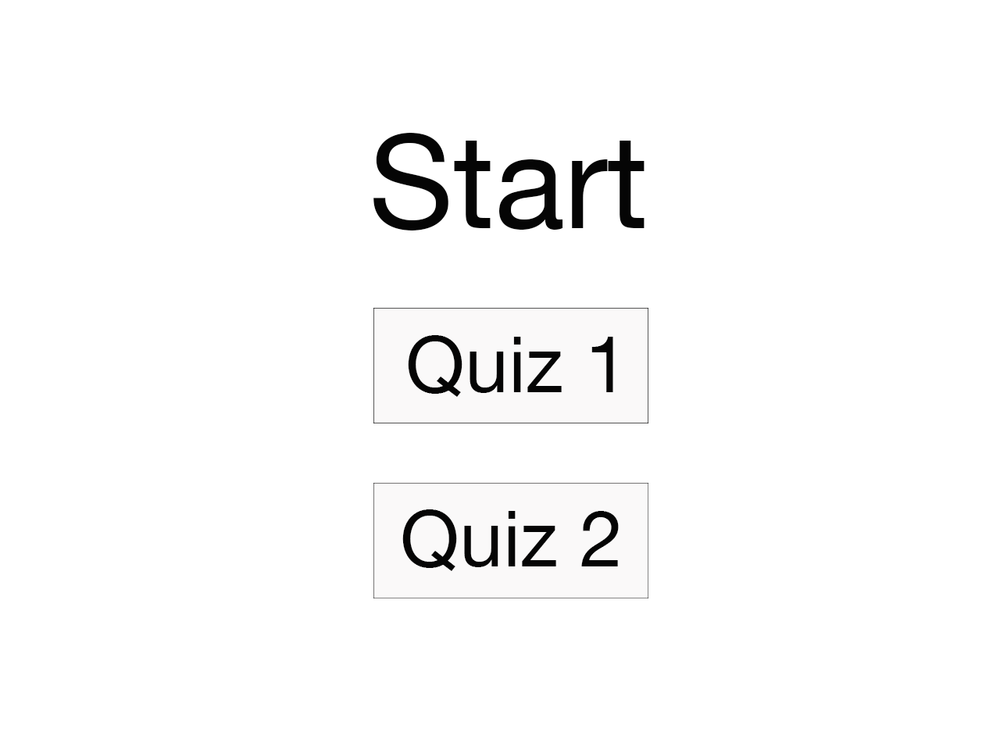
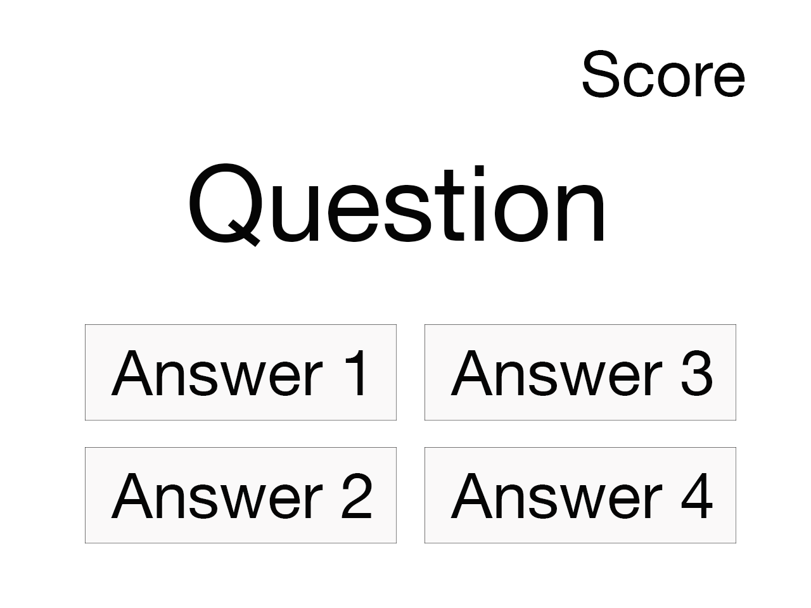
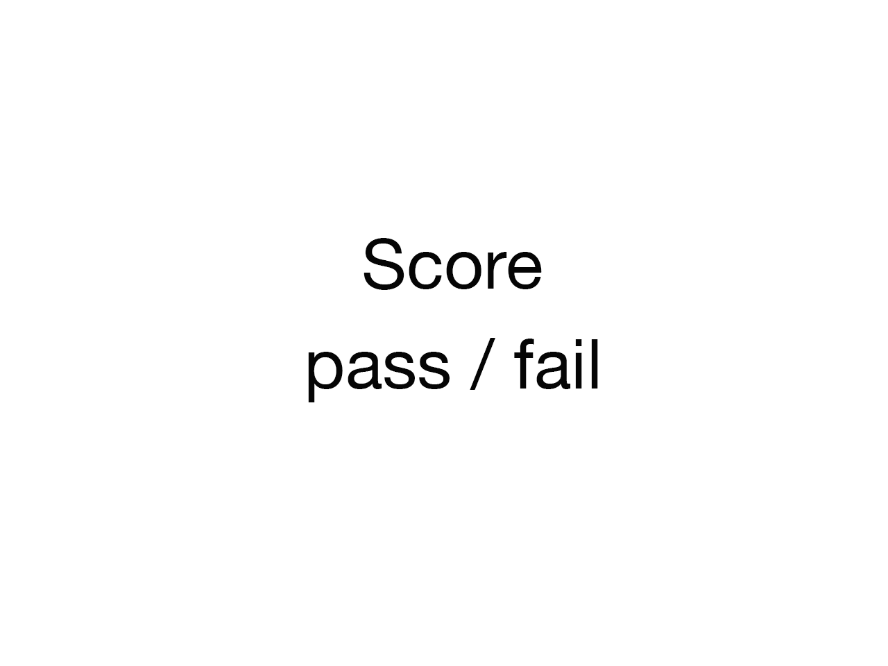

# App Developer Entrance Project

Create a client-side quiz app based on the provided requirements, data and views.


## Requirements

- clone this repo as a starter
- use only HTML/CSS/JS
- use any frameworks or libraries of your choice (ex: JQuery, React, Bootstrap)

## Quiz Data

Quiz data can be found in [src/quiz.json](./src/quiz.json). This content will be loaded when a user starts a quiz.

For every question there is one correct answer (with a value of `true`) and three incorrect answers with a value of `false`. The `content` field contains a possible answer.

```js
{
  quizzes: [{
    title: 'Quiz 1',
    questions: [{
      question: 'Question 1?'
      answers: [{
        content: 'Answer 1.',
        value: false // wrong answer
      }, {
        content: 'Answer 2.',
        value: true // correct answer
      }]
    }]
  }]
}
```

## Views

Feel free to be creative and style your views. As a bare minimum, please create the following three views:

##### 01 - Welcome Screen



The view presented when the user starts the app.

- load either quiz 1 or quiz 2 on click

##### 02 - Quiz View



While the user is selecting their answers:

- display all 3 questions with possible answers
- provide feedback when a user clicks on an answer. Consider styling correct or wrong answers with green or red button colors
- show the next question after a time delay of 2 seconds
- track the number of correct answers in the top right corner

##### 03 - Completion View



When the user has finished answering all three questions:

- display the final score
- show a "pass" message if more than 50% of the answers were correct, show a "fail" message otherwise

## Upon Project Completion

- push your finished app to Github
- provide your username and repo to an instructor

Good luck!
