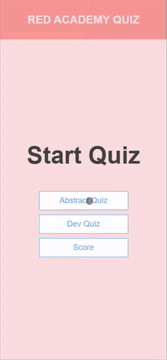
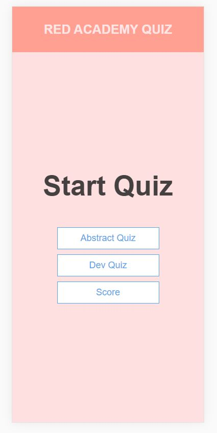
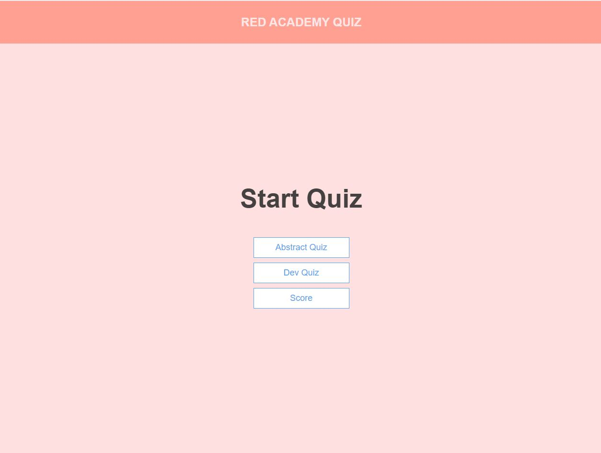
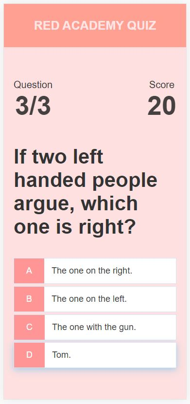
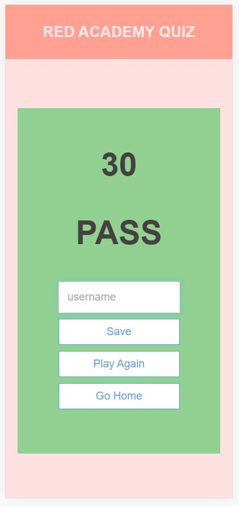
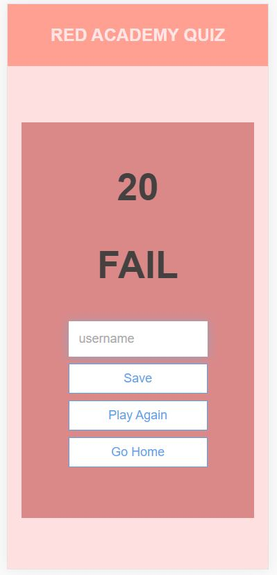
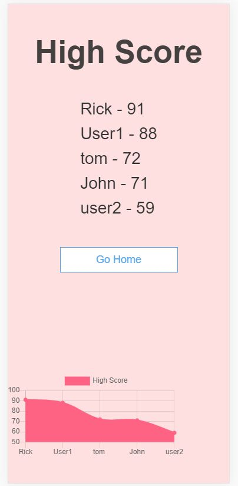

# App Developer Entrance Project

Create a client-side quiz app based on the provided requirements, data and views.


## Index
- [Requirements](#requirements)
- [Quiz Data](#quiz-data)
- [Views Requirment](#views)
- [Running](#running)
- [Demo](#demo)
- [Goals](#goals)
- [Future Goals](#future-goals)
- [Contact](#contact)


## Requirements

- clone this repo as a starter
- use only HTML/CSS/JS
- use any frameworks or libraries of your choice (ex: JQuery, React, Bootstrap)

## Demo




## Quiz Data

Quiz data can be found in [src/quiz.json](./src/quiz.json). This content will be loaded when a user starts a quiz.

For every question there is one correct answer (with a value of `true`) and three incorrect answers with a value of `false`. The `content` field contains a possible answer.

```js
{
  quizzes: [{
    title: 'Quiz 1',
    questions: [{
      question: 'Question 1?'
      answers: [{
        content: 'Answer 1.',
        value: false // wrong answer
      }, {
        content: 'Answer 2.',
        value: true // correct answer
      }]
    }]
  }]
}
```

## Views

As a bare minimum, please create the following three views:

##### 01 - Welcome Screen

The view presented when the user starts the app.

- load either quiz 1 or quiz 2 on click

##### 02 - Quiz View

While the user is selecting their answers:

- display all 3 questions with possible answers
- provide feedback when a user clicks on an answer. Consider styling correct or wrong answers with green or red button colors
- show the next question after a time delay of 2 seconds
- track the number of correct answers in the top right corner

##### 03 - Completion View

When the user has finished answering all three questions:

- display the final score
- show a "pass" message if more than 50% of the answers were correct, show a "fail" message otherwise


## Running
#### Python 3 
```js
python -m http.server
```
Open browser and type ```localhost:8080```

For More Info: https://docs.python.org/3.0/library/http.server.html

#### Python 2
```js
python -m SimpleHTTPServer
```

#### Node.js
```js
http-server
```
- run the command: ```npm install http-server -g```
- Open browser and type ```localhost:8080```


## Views

Home (Mobile View)



Home (Desktop View)



Quiz



Pass



Fail



Score




## Goals
:white_check_mark: Welcome Screen

:white_check_mark: Quiz 1 btn, Quiz 2 btn, Score

:white_check_mark: Quiz View

:white_check_mark: display all 3 questions with possible answers

:white_check_mark: provide feedback when a user clicks on an answer

:white_check_mark: show the next question after a time delay of 2 seconds

:white_check_mark: track the number of correct answers in the top right corner

:white_check_mark: Completion View

:white_check_mark: display the final score

:white_check_mark: show a "pass" message / "fail" message

:white_check_mark: Save user name in local storage with score

:white_check_mark: Change Background color based on Pass or Fail

:white_check_mark: Chart of Scores

:white_check_mark: Header which on click will take to Home


## Future Goals
:clock1: On Fail: Add motivational quote

:clock1: Add Dynamic Chart

:clock1: Show Hint in Quiz ```on click```


## Contact
:mailbox: Mail: nikhil4.deswal@gmail.com
